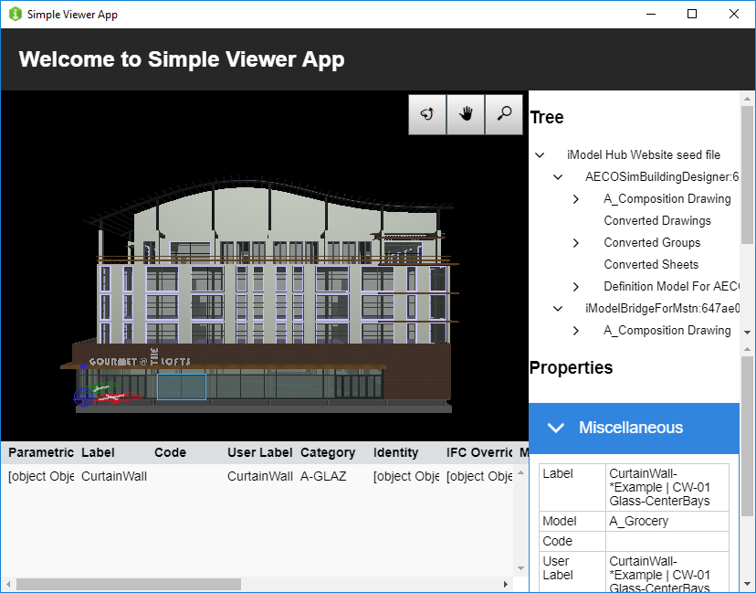

# Simple Viewer App

An iModel.js sample application that demonstrates opening an iModel and viewing its data. The data is presented using the following components:

- _Viewport_: Renders geometric data onto an HTMLCanvasElement.
- _Tree_: Displays a hierarchical view of iModel contents.
- _Property Grid_: Displays properties of selected element(s).
- _Table_: Displays element properties in a tabular format.

This app serves as a guide on how you can embed one or more of these components into your own application.
See http://imodeljs.org for comprehensive documentation on the iModel.js API and the various constructs used in this sample.

## Development Setup
Edit [src/common/configuration.ts](./src/common/configuration.ts) and set following variables. Read [Developer Registration](https://imodeljs.github.io/iModelJs-docs-output/getting-started/#developer-registration) to find out how can you get values for these variables.


* `imjs_test_oidc_client_id`: Specify OIDC client id.
* `imjs_test_oidc_redirect_path`: Specify redirect parth for OIDC.
* `imjs_test_project`: Specify name of the project to open.
* `imjs_test_imodel`: Specify name of the imodel in the project to open.

To start the application, simply install its dependencies and run it:

```sh
npm install
npm start
```

The `npm start` script automatically starts Web and Electron applications.



## Purpose

The purpose of this application is to demonstrate the following:

- [Dependencies](./package.json) required for iModel.js-based frontend applications.
- [Scripts](./package.json) recommended to build and run iModel.js-based applications.
- How to set up a simple backend for
  [web](./src/backend/web/main.ts) and
  [electron](./src/backend/electron/main.ts).
- How to set up a simple [frontend for web and electron](./src/frontend/api/SimpleViewerApp.ts).
- How to [implement OIDC sign-in](./docs/oidc.md) to get access to iModels on iModelHub.
- How to [consume](./src/frontend/components/App.tsx) iModel.js React components.
- How to implement unified selection between a
  [viewport](./src/frontend/components/Viewport.tsx),
  [tree](./src/frontend/components/Tree.tsx),
  [property grid](./src/frontend/components/Properties.tsx) and a
  [table](./src/frontend/components/Table.tsx).
- How to include
  [tools](./src/frontend/components/Toolbar.tsx) in a
  [viewport](./src/frontend/components/Viewport.tsx).

## Contributing

[Contributing to iModel.js](https://github.com/imodeljs/imodeljs/blob/master/CONTRIBUTING.md)
